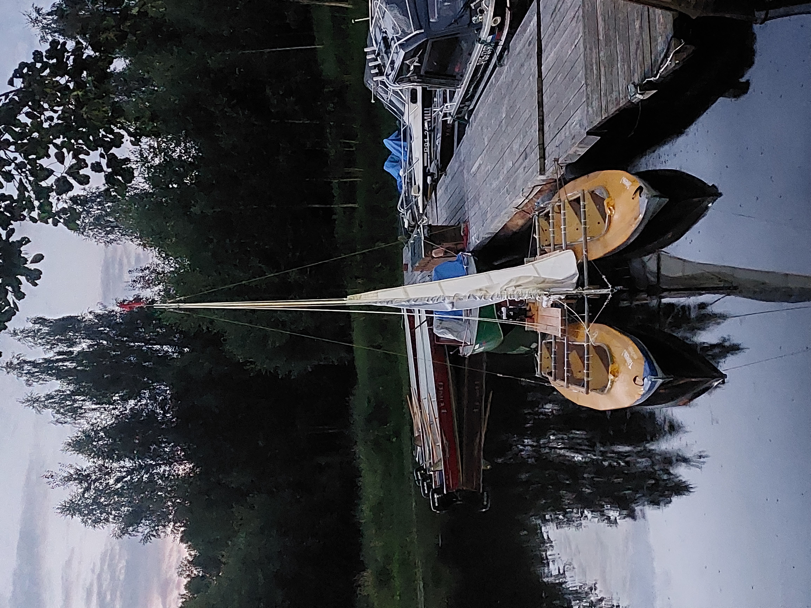
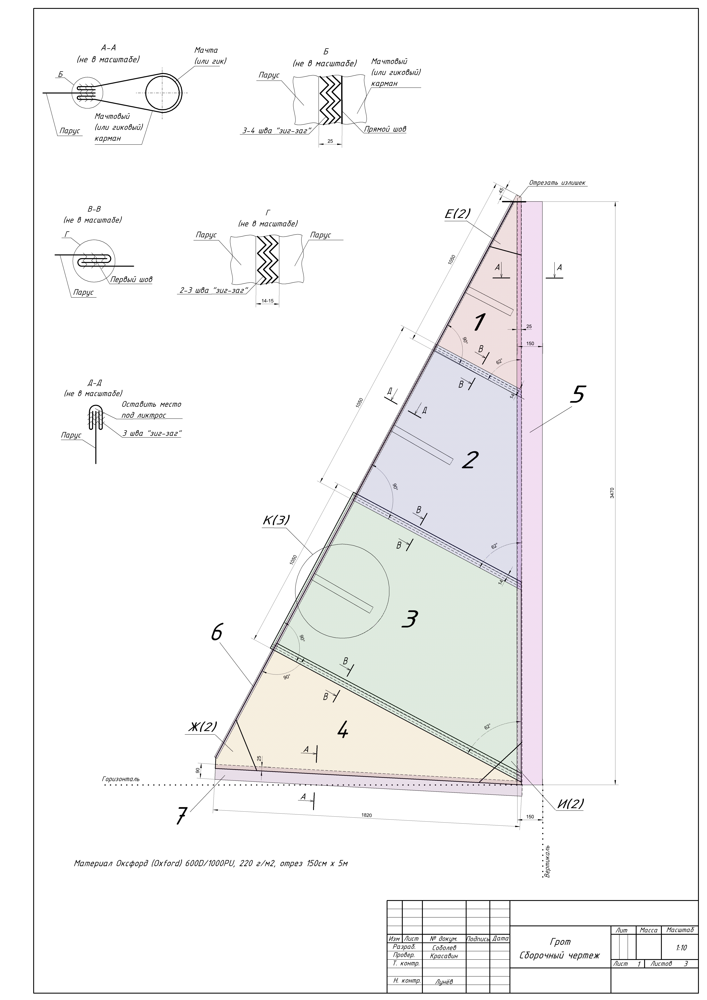

# Чертежи парусного катамарана, сделанного из двух байдарок Таймень-3 и вооруженного гротом и стакселем #

## Фото собранного катамарана  ##

## Выявленные недостатки конструкции по результатам испытаний ##

* По большой открытой воде на достаточном удалении от берега (300-400 м) и проходящих рядом катерах - страшноватая качка
* Испытания на непотопляемость не проводились, в качестве ёмкостей непотопляемости использовались 4 надувных матраса под бортами 2-го и 3-го отсеков байдарок
* Недостаточная прочность втулки балера (устранено при испытаниях путем упрочнения укороченным винтом М6)
* Недостаточная прочность стрингера от проворачивания при повороте руля на большие углы (устранено при испытаниях путем замены пружинной кнопки крепления стрингера на болт М6)
* Слишком большой дейдвуд (может быть устранено уменьшением в 2 раза высоты транцевой доски палубы)
* Недостаточная площадь парусности для слабых ветров, в лавировку катамаран практически не идет, только попутным ветром (предлагается увеличить площадь грота до 5,8-6,0 м^2)
* При увеличении площади грота увеличить длину мачты на 1,8-2,0 м
* Узел крепления шверта на бимсу сделать через дополнительную втулку 40 мм, существующий вариант трудно собирать/снимать
* Для удержания шверта в вертикальном положении либо предусмотреть оттяжки, либо груз на конце
* Двойной блок оттяжки гика следует крепить на мачту, не на стрингер
* Утки шкотов следует перенести ближе к капитану на корму
* Треугольные боковые оттяжки мачты себя мало оправдали - следует сделать обычные оттяжки к 1-му бимсу, заменив стальные тросы на веревки (так проще регулировать)
* 1-й и 3-й бимсы не выдержали нагрузки (трубы 40х1,5мм), надо заменить все бимсы на трубы 40х3мм
* Узел пятки гика сделан в итоге не по чертежам, а просто скобой из полосы дюраля

## Чертежи и виды ##

